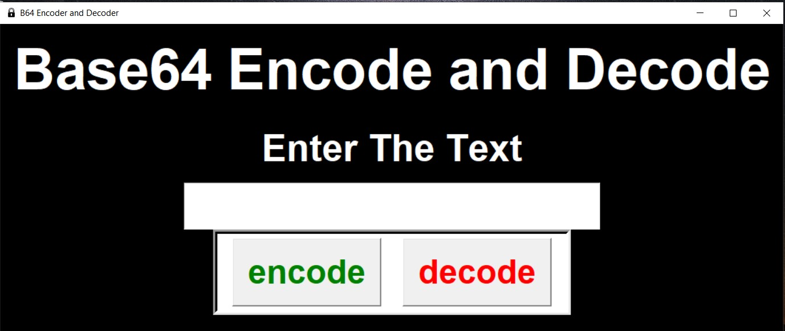

# Base-64-offline

For linux download python then download & run the linux code  
 Command To Install python 
<code>
sudo apt install python  
pip install tk
</code>

For Windows user just download from  
 release and tap on exe file or just tap on the exe file in the source then download

