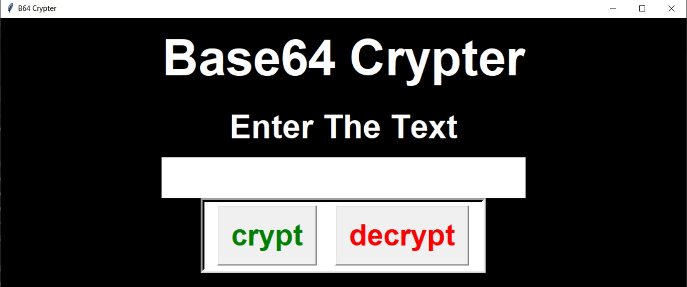

# Base-64-offline-crypter

For linux download python then download & run the linux code  
 Command To Install python and Tkinter(mainly for linux user) 

sudo apt install python  

`pip install tk ttk`

`python Base64_offline.pyw`

For Windows user just download from  
 release and tap on exe file or just tap on the exe file in the source then download

To build the exe

`pip install pyinstaller`

`pyinstaller --onefile --icon "encrypt.ico" --add-binary "encrypt.ico;." Base64_offline.pyw`

